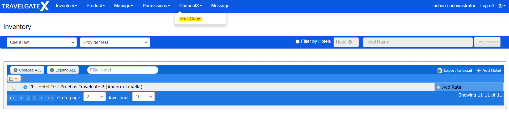

# Full Copy and Deltas

### Full Copy

Once you have configured your system to receive our requests, you will need to perform a Full Copy to load the products into your system. To do this, go to the [Inventory Extranet](https://inventory.xmltravelgate.com/Account/Login?ReturnUrl=%2f) and click on Channel-X > Full Copy. The purpose of this is to receive the products into your system initially and then obtain a complete refresh of the product.

### Deltas

After the first Full Copy, when the Seller makes an update, Channel-X will send a smaller product request (Delta) to notify the Buyer of the change. Each `Delta` element can have one of these three states: `New`, `Delta`, `Remove`. It will be indicated in its correspondent tag.

* `New`: it means the element was not added before. You should add the element in your system with the information provided.

* `Delta` (modification): it means the element was created before but it has been edited. The element should be already created in your system and you should change the information of it with the new one. 

:::note

You will receive all element information, although not all the information sent may have changed. You can choose to override all existing data or selectively update the changed aspects.

:::

* `Remove`: it means the element has been removed. You should delete the element in your system and all its dependences. 

:::note

When deleting an element (hotel, rate, or room), you will only receive the code in the request. In such cases, it's necessary to remove from your system all elements that depend on the one being deleted.

:::

## Frequently asked questions

    
How do I know whether it is a Full Copy or a Delta?

    

        
Full Copy will transmit significantly more information than a simple Delta. Additionally, it will be indicated in the attribute value as "FullCopy" or "Delta."

    

    
What does New, Delta and Remove mean?

    

        
Rates can be created, deleted or modified. "New" means a newly added rate, "Delta" is for a changed rate, and "Removed" is used when a rate is deleted.

    

    
What happens if a rate is deleted, does Travelgate inform us of this in the Full Copy?

    

        
Not in the Full Copy. If a rate is deleted and you run a Full Copy, you'll only receive the currently loaded information. Notification about the removed rate will come through a Delta after its deletion.

    

