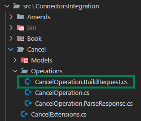

## **Mock**

### **Step 1: Define your Cancel responses (Mocks)**

Define the responses for your operation, it is mandatory to insert a supplier response into every mock or at least, into the mocks of the operation you will be developing.

We will be using the **TwoAdultTwoDays** mock through all the steps of the development.

File location: "**test\MockServer\Tests\Cancel\Two_Adults_Two_Days.txt**"


### **Step 2: Define the Models of your response (Request and Response models)**

These models are crucial because they specify the structure of the objects contained within supplier responses. They'll also play a vital role in serializing and deserializing requests and responses during development.


**Example of a CancelRequest model**:

```csharp
namespace ConnectorsIntegration.Cancel.Models.Request;

public class CancelRequest
{
    public string ClientReference { get; set; }
    public string SupplierReference { get; set; }
}
```
File location: "**ConnectorsIntegration\Cancel\Models\Response\CancelRequest.cs**"

**Example of a CancelResponse model**:

```csharp
namespace ConnectorsIntegration.Cancel.Models.Response;

public class CancelResponse
{
    public SupplierOption Option { get; set; }
}

public class SupplierOption
{
    public string Status { get; set; }
    public SupplierPrice SupplierPrice { get; set; }
    public string supplierReference { get; set; }
}

public class SupplierPrice
{
    public string Currency { get; set; }
    public double Net { get; set; }
    public double MinimumSellingPrice { get; set; }
}
```
File location: "**ConnectorsIntegration\Cancel\Models\Response\CancelResponse.cs**"

## **Develop**

### **Step 1: Register the serializers and operations**
To specify which serializer and operations the developer will be using (based on the seller's API) we can specify it in our "**Extensions**":

File location: "**ConnectorsIntegration\Cancel\CancelExtensions.cs**"

If the seller works with **JSON** format, we can specify the integration to work with **JSON** with the following:

```csharp
internal static class CancelExtensions
{
    public static void AddCancelServices(this IServiceCollection services,
        IConfiguration configuration)
    {
        //A JsonSerializer service is added along with the request and response model
        services.AddJsonSerializer<CancelRequest, CancelResponse>(ConfigureJSONOptions);
        //The operation is added, indicating what models should be used during the development of the operation
        services.AddCancelOperation<CancelOperation, CancelRequest, CancelResponse, AccessModel>(TgxPlatform.Name,
            configuration);
    }
    private static void ConfigureJSONOptions(JsonSerializerOptions options) { }
}
```

For details about others serializers, check [Extensions](../../Advanced_Use/Extensions)

For more details about operations, check [PreOperations](../../Connector_Framework/PreOperation_Overview) and [Operations](../../Connector_Framework/Operation_Overview)

### **Step 2: CancelOperation validators**

There are two previous validations that serve as a filter so the buildrequest and the parseresponse are as safe as possible. They can be found in the CancelOperation.cs class:

File location: "**ConnectorsIntegration\Cancel\Operations\CancelOperation.cs**"


**TryValidateModelRequest**

This step validates the incoming request from the client. While most validation is defined in the [metadata](../../Advanced_Configuration/Metadata_Definition), this step is used for specific edge cases that cannot be generalized.

**Example Use Case:** In a operation, validating that hotel codes are numeric because supplier do not allow non-numeric hotels. This type of validation would not be covered by metadata.

```csharp
public bool TryValidateModelRequest(
    CancelConnectorRequest connectorsRequest, 
    CancelParameters<CntAccessModel> connectorParameters,
    out IEnumerable<AdviseMessage> adviseMessages)
{
    //AdviseMessages are used to specify errors, such as checking if the hotel code is numeric and if not, add an AdviseMessage
    adviseMessages = default;
    return true; // Validation passes if no issues are found.
}

```

**TryValidateSupplierResponses**

Once the supplier's response is received, this step validates it for errors or anomalies. Suppliers may return incomplete or erroneous data, so this step ensures only valid responses are processed further.

**Details**:

- Check for supplier-specific error fields.
- Ensure required fields (e.g., hotel list) are present.
- Example Use Case: A supplier might return a response with an error code or an empty hotel list. This step would detect and handle such cases.

```csharp
public bool TryValidateSupplierResponses(
    CancelParameters<CntAccessModel> connectorParameters,
    IEnumerable<SupplierResponseWrapper<CancelResponse>> supplierResponses,
    out IEnumerable<AdviseMessage> adviseMessages)
{
    var supplierResponseWrappers = supplierResponses as SupplierResponseWrapper<CancelResponse>[] ?? supplierResponses.ToArray();
    
    var success = ResponseValidator.TryValidateSupplierResponses(supplierResponseWrappers, out adviseMessages);

    if (!success) return false;
    
    if (supplierResponseWrappers.ElementAt(0).Response.HotelCancel?.Hotel is null)
    {
        adviseMessages =
        [
            AdviseMessage.BuildSupplierNoResults() // Indicates no results from the supplier.
        ];

        return false;
    }

    return true; // Validation passes if no issues are found.
}
```

### **Step 3: Build the Seller's request**

This class will contain a "BuildRequests" method that will have the following args: 

- Object of the requests from the models previously created (CancelRequest)
- The request that the buyer sends (connectorsRequest)
- Parameters (connectorParameters) which will have some helpers:

File location: "**ConnectorsIntegration\Cancel\Operations\CancelOperation.BuildRequest.cs**"



**Example of Build Request:**

```csharp
using Connectors.Core.Application.Connection;
using Connectors.Pull.Hotel.Application.Operations.Cancel;
using ConnectorsIntegration.Cancel.Models.Request;

namespace ConnectorsIntegration.Cancel.Operations;

internal partial class CancelOperation
{
    public IEnumerable<SupplierRequestWrapper<CancelRequest>> BuildRequests(
        CancelConnectorRequest connectorsRequest,
        CancelParameters<AccessModel> connectorParameters)
    {
        var clientReference = connectorsRequest.CancelRq.Input.Reference.ClientLocator;
        var supplierReference = connectorsRequest.CancelRq.Input.Reference.SupplierLocator;

        CancelRequest cancelRequest = BuildCancelRequest(
            clientReference,
            supplierReference);

        //Generic URL we prepared back in the AccessModel, which will be passed by the buyer
        string genericUrl = connectorParameters.ParametersModel.UrlGeneric;

        SupplierRequestWrapper<CancelRequest> supplierRequest = new(
            cancelRequest,
            new Uri(genericUrl),
            HttpMethod.Post);

        return
        [
            supplierRequest
        ];
    }

    private static CancelRequest BuildCancelRequest(
        string clientReference,
        string sellerReference) 
    {
        //The request towards the seller system
      
        return new CancelRequest()
        {
            ClientReference = clientReference,
            SellerReference = sellerReference
        };
    }
}
```

### **Step 4: Parse the Seller's response**

Once the request has been sent, we will have to control and parse the response returned by the seller.

We will be implementing the "ParseResponse" step inside CancelOperation:

File location: "**ConnectorsIntegration\Cancel\Operations\CancelOperation.ParseResponse.cs**"


**Example of Parse Response:**

```csharp
using Connectors.Core.Application.Connection;
using Connectors.Core.Application.Iso;
using Connectors.Core.Domain;
using Connectors.Pull.Hotel.Application.Operations.Cancel;
using Connectors.Pull.Hotel.Domain.Contracts.Common;
using Connectors.Pull.Hotel.Domain.Contracts.Cancel.Response;
using ConnectorsIntegration.Cancel.Models.Response;

namespace ConnectorsIntegration.Cancel.Operations;

internal partial class CancelOperation
{
    public CancelConnectorResponse ParseResponses(
        CancelConnectorRequest connectorsRequest,
        CancelParameters<AccessModel> connectorParameters,
        IEnumerable<SupplierResponseWrapper<CancelResponse>> supplierResponses,
        CancellationToken cancellationToken)
    {
        var supplierResponse = supplierResponses.First().Response;
        return new CancelConnectorResponse(ParseSupplierResponse(supplierResponse));
    }

    private CancelRs ParseSupplierResponse( CancelResponse supplierResponse)
    {
        var supplierOption = supplierResponse.Option;
        
        BookStatus status = MapSellerToTgxStatus(supplierOption.Status);
        Price price = ParseSupplierPrice(supplierOption.SupplierPrice);

        var clientReference = supplierOption.ClientReference;
        var supplierReference = supplierOption.SupplierReference;

        return new CancelRs(new Reference(clientReference, supplierReference), status)
        {
            CancelPrice = price
        };
    }

    private static PenaltyType MapSellerToTgxPenaltyType(string penaltyType) => penaltyType switch
    {
        "Percent" => PenaltyType.Percentage,
        "Nights" => PenaltyType.Nights,
        _ => PenaltyType.Amount
    };

    private static BookStatus MapSellerToTgxStatus(string status) => status switch
    {
        "Canceled" => BookStatus.Ok,
        "OnRequest" => BookStatus.OnRequest,
        _ => BookStatus.Unknown
    };

    private static Price ParseSupplierPrice(SupplierPrice supplierPrice)
    {
        Currency supplierCurrency = CurrencyIso4217Mapper.Map(supplierPrice.Currency);
        //Helper that builds a net price
        var price = Price.BuildNetPrice(supplierCurrency, supplierPrice.Net, supplierPrice.MinimumSellingPrice);

        return price;
    }
}
```

For more details about helpers, check the - [Price helpers](../../Tools_and_Helpers/Price_Helpers/PriceHelpers) and [Policies helpers](../../Tools_and_Helpers/Policies_Helpers/PoliciesHelpers) 

For more details about the combinatory, check [Recommended Helpers](../../Tools_and_Helpers/Recommended_Helpers)

## **Test**

### **Option 1: Integration Tests**
Use the integration tests provided by Travelgate to validate your implementation:
- Add the necessary use cases to the **MockServer** for each operation.
  - [View MockServer Documentation](../../Connector_Framework/MockServer_Documentation.mdx).
- Execute the associated tests for the implemented operation.
  - [View Running Integration Tests](../../Connector_Framework/Running_Integration_Tests.mdx).

### **Option 2: FormTest Tool (Shopping)**
Use the **FormTest** application to test each operation manually:
- Configure the tool to use your supplier's API settings.
- Test specific scenarios not covered by predefined use cases.
- [View FormTest Documentation](../../Tools_and_Helpers/FormTest_Documentation.mdx).
 
## **Code Review**

### **Step 1: Create Pull Request**

    - Commit your changes and push them to a new branch called "**CancelDevelopment**" into the original repository.
    - Separate the Pull Request into minimum these 4 commits:
        - Mock responses
        - Request and Response models
        - BuildRequest
        - ParseResponse

### **Step 2: Wait for Travelgate review**
    - This step involves waiting for the Travelgate team to review and approve the submitted pull request, for more details, check [Code Review Details](../Code_Review/Code_Review_Details.mdx)
