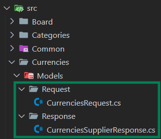
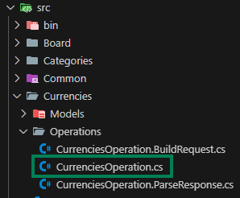
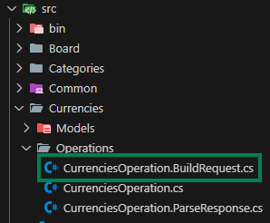
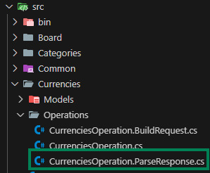

## Currencies

This operation is designed for the comprehensive retrieval of full **Currencies** static data.

## **Models**

### **Step 1: Define the Models of your response (Request and Response models)**

These models are crucial because they specify the structure of the objects contained within supplier responses. They'll also play a vital role in serializing and deserializing requests and responses during development.



**Currencies** usually do not require any request model, as they are HTTP GET methods.

Response example:

```csharp
public class CurrenciesSupplierResponse
{
    public List<Currencies> Currencies { get; set; }
}

public class Currencies
{
    public string Code { get; set; }
    public string Name { get; set; }
}
```

## **Develop**

### **Step 1: Register the serializers and operations**
To specify which serializer and operations the developer will be using (based on the seller's API) we can specify it in our "**Extensions**":

File location: "**Currencies\CurrenciesExtensions.cs**"

If the seller works with **JSON** format, we can specify the integration to work with **JSON** with the following:

```csharp
using System.Text.Json;
using Connectors.Content.Pull.Api.Extensions.Currencies;
using Connectors.Core.App.Extensions;
using ConnectorsTemplateContent.Common.Constants;
using ConnectorsTemplateContent.Currencies.Models.Request;
using ConnectorsTemplateContent.Currencies.Models.Response;
using CurrenciesOperation = ConnectorsTemplateContent.Currencies.Operations.CurrenciesOperation;

namespace ConnectorsTemplateContent.Currencies;

public static class CurrenciesExtensions
{
    public static void AddCurrenciesServices(this IServiceCollection services,
        IConfiguration configuration)
    {
        services.AddJsonSerializer<CurrenciesRequest, CurrenciesSupplierResponse>(ConfigureJSONOptions);
        services.AddCurrenciesOperation<CurrenciesOperation, CurrenciesRequest, CurrenciesSupplierResponse, AccessModel>(
            TgxPlatform.Name, configuration);
    }
    private static void ConfigureJSONOptions(JsonSerializerOptions options) { }
}
```

### **Step 2: CurrenciesOperation validators**

There are two previous validations that serve as a filter so the buildrequest and the parseresponse are as safe as possible. They can be found in the SearchOperation.cs class:

File location: "**Currencies\Operations\CurrenciesOperation.cs**"



**TryValidateModelRequest**

This step validates the incoming request from the client. While most validation is defined in the [metadata](../../Advanced_Configuration/Metadata_Definition), this step is used for specific edge cases that cannot be generalized.

```csharp
public bool TryValidateModelRequest(ContentRequest connectorsRequest,
    ContentOperationParameters<AccessModel> connectorParameters,
    out IEnumerable<AdviseMessage> adviseMessages)
{
    adviseMessages = null;
    return true;
}
```

**TryValidateSupplierResponses**

Once the supplier's response is received, this step validates it for errors or anomalies. Suppliers may return incomplete or erroneous data, so this step ensures only valid responses are processed further.

**Details**:

- Check for supplier-specific error fields.
- Ensure required fields (e.g., currencies list) are present.
- Example Use Case: A supplier might return a response with an error code or an empty currencies list. This step would detect and handle such cases.

```csharp
public bool TryValidateSupplierResponses(ContentOperationParameters<AccessModel> connectorParameters,
    IEnumerable<SupplierResponseWrapper<CurrenciesSupplierResponse>> supplierResponses,
    out IEnumerable<AdviseMessage> adviseMessages)
    {
    var supplierResponseWrappers = supplierResponses as SupplierResponseWrapper<CurrenciesSupplierResponse>[] ?? supplierResponses.ToArray();
    
    var success = ResponseValidator.TryValidateSupplierResponses(supplierResponseWrappers, out adviseMessages);

    if (!success) return false;
    
    if (supplierResponseWrappers.ElementAt(0).Response.Currencies is null)
    {
        adviseMessages =
        [
            AdviseMessage.BuildSupplierNoResults() // Indicates no results from the supplier.
        ];

        return false;
    }

    return true; // Validation passes if no issues are found.
}
```
### **Step 3: Build the Seller's request**

This class will contain a "BuildRequests" method that will have the following args: 

- Object of the requests from the models previously created (CurrenciesRequest).
- The request that the buyer sends (connectorsRequest).
- Parameters (connectorParameters) which will have some helpers.

File location: "**Currencies\Operations\CurrenciesOperation.BuildRequest.cs**"



**Example of Build Request:**
```csharp
using Connectors.Content.Pull.Application.Operations;
using Connectors.Core.Application.Connection;
using ConnectorsTemplateContent.Currencies.Models.Request;
namespace ConnectorsTemplateContent.Currencies.Operations;

internal partial class CurrenciesOperation
{
    public IEnumerable<SupplierRequestWrapper<CurrenciesRequest>> BuildRequests(ContentRequest connectorsRequest,
        ContentOperationParameters<AccessModel> connectorParameters)
    {
        string genericUrl = connectorParameters.ParametersModel.GenericUrl;

        var request = new SupplierRequestWrapper<CurrenciesRequest>(
            null,
            new Uri(genericUrl),
            HttpMethod.Post);

        return new List<SupplierRequestWrapper<CurrenciesRequest>>()
        {
            request
        };  
    }
}
```

### **Step 4: Parse the Seller's response**

Once the request has been sent, we will have to control and parse the response returned by the seller.

We will be implementing the "ParseResponse" step inside CurrenciesOperation:

File location: "**Currencies\Operations\CurrenciesOperation.ParseResponse.cs**"



**Example of Parse Response:**

```csharp
using Connectors.Content.Pull.Application.Operations;
using Connectors.Content.Pull.Application.OperationsCurrencies;
using Connectors.Content.Pull.Domain.Contracts;
using Connectors.Core.Application.Connection;
using ConnectorsTemplateContent.Currencies.Models.Response;
using Content.Common.Domain.AccumulativeContracts.Currency;

namespace ConnectorsTemplateContent.Currencies.Operations;

internal partial class CurrenciesOperation
{
    public CurrenciesResponse ParseResponses(ContentRequest connectorsRequest,
        ContentOperationParameters<AccessModel> connectorParameters,
        IEnumerable<SupplierResponseWrapper<CurrenciesSupplierResponse>> supplierResponses,
        CancellationToken cancellationToken)
    {
        ParseSupplierCurrencies(supplierResponses.First().Response);
        return new CurrenciesResponse(new CurrenciesRs());
    }

    private void ParseSupplierCurrencies(CurrenciesSupplierResponse response)
    {
        foreach (var board in response.Currencies)
        {
            //Accumulator is used instead of returning an object with the response.
           _accumulator.AddValue(new AccumulativeCurrency()
            {
                Code = board.Code,
                Names = new Dictionary<Iso2LanguageEnum, string>
                {
                    { Iso2LanguageEnum.EN, board.Name },
                }
            });
        }
    }
}
```

## **Code Review**

### **Step 1: Create Pull Request**

    - Commit your Search changes and push them to a new branch called "**CurrenciesDevelopment**" into the original repository.
    - Separate the Pull Request into minimum these 4 commits:
        - Request and Response models
        - BuildRequest
        - ParseResponse

### **Step 2: Wait for Travelgate review**
    - This step involves waiting for the Travelgate team to review and approve the submitted pull request, for more details, check [Code Review Details](../Code_Review/Code_Review_Details.mdx)
