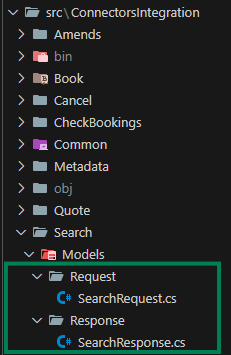

# Develop a Connector

:::caution
### **Prior to the API implementation**

To ensure a successful implementation, candidates should possess the following foundational knowledge and skills:

1. **Solid Travel Trade business knowledge**: This includes understanding the intricate relationships and operational dynamics among hotels, sellers, and buyers, and how these entities typically interact with their partners.
2. **Proficiency in C# Programming**: A strong command of C# is preferred, as it is the primary programming language utilized in the development process. Candidates also must have a comprehensive understanding of software testing principles (Unit tests/Integration tests).
3. **Familiarity with Travelgate's Data Model**: A thorough understanding of how Travelgate processes and structures data pertaining to options, rooms, boards, and policies is crucial [(Check Travelgate's Business Model)](../Shopping_Workflow/#travelgates-business-model). This knowledge will facilitate accurate mapping and integration with the seller's API.

:::

## **Start a Connector**

### **Step 1: Download the template.**
The first step is to clone the repository from Github where the integration will be created based on a template (The github URL will be given to the person developing)

(INSERTAR LINK?)

### **Step 2: Prepare your responses (Mock)**
For step 2 it is necessary to define the responses for your operations, it is recommended is to insert a supplier response into every mock or at least, into the mocks of the operation you will be developing (hence, the first one will always be search mocks).

We will be using the **TwoAdultTwoDays** mock in (in the "**tests -> MockServer -> Tests**" folder) through all the steps of the development (this use case is present in all operations)


### **Step 3: Define the Models of your response (Request and Response models)**
Next, you'll define the data models for your requests and responses. These models are crucial because they specify the structure of the objects contained within supplier responses. They'll also play a vital role in serializing and deserializing requests and responses during development.



**Example of a SearchRequest model** (File: SearchRequest.cs):

```csharp
public class SearchRequest
{
    public string HotelCode { get; set; }
    public DateTime Checkin { get; set; }
    public DateTime Checkout { get; set; }
    public string Currency { get; set; }
    public List<Room> Rooms { get; set; }
}

public class Room
{
    public List<Pax> Paxes { get; set; }
}

public class Pax
{
    public string Type { get; set; }
    public int Age { get; set; }
}
```

**Example of a SearchResponse model** (File: SearchResponse.cs):

```csharp
public class SearchResponse
{
    public List<Option> Options { get; set; }
}

public class Option
{
    public Price Price { get; set; }

    public Rooms Rooms { get; set; }

    public string BoardCode { get; set; }

    public HotelInformation HotelInformation { get; set; }

    public PoliciesInformation PoliciesInformation { get; set; }
}

public class Price
{
    public decimal TotalAmount { get; set; }

    public string Currency { get; set; }

    public decimal TaxesAndFees { get; set; }

    public List<decimal> PerNightBreakdown { get; set; }
}

public class Rooms
{
    public int NumberOfRooms { get; set; }

    public string RoomType { get; set; }

    public int MaxOccupancy { get; set; }

    public List<string> Amenities { get; set; }
}

public class HotelInformation
{
    public string HotelId { get; set; }

    public string Name { get; set; }

    public int StarRating { get; set; }

    public string Address { get; set; }

    public string Description { get; set; }
}

public class PoliciesInformation
{
    public string CancellationPolicy { get; set; }

    public TimeSpan CheckInTime { get; set; }

    public TimeSpan CheckOutTime { get; set; }

    public string PaymentPolicy { get; set; }
}
```

### **Step 4: Add the necessary JSON or XML serializers**
Travelgate contemplates two types of models, either JSON or XML. To specify which one the developer will be using (based on the seller's API) we can specify the following in our "Extensions":

File: SearchExtensions.cs

If the seller works with **JSON** format, we can specify the integration to work with **JSON** with the following:

```csharp
internal static class SearchExtensions
{
    public static void AddSearchServices(this IServiceCollection services,
        IConfiguration configuration)
    {
        //A JsonSerializer service is added along with the request and response model
        services.AddJsonSerializer<SearchRequest, SearchResponse>(ConfigureJSONOptions);
        //The SearchOperation is added, indicating what models should be used during the development of the Search operation
        services.AddSearchOperation<SearchOperation, SearchRequest, SearchResponse, AccessModel>(TgxPlatform.Name,
            configuration);
    }
    private static void ConfigureJSONOptions(JsonSerializerOptions options) { }
}
```

If the seller works with **XML** format, we can specify the integration to work with **XML** with the following:

```csharp
internal static class SearchExtensions
{
    public static void AddSearchServices(this IServiceCollection services,
        IConfiguration configuration)
    {
        services.AddXmlSerializer<SearchRequest, SearchResponse>(ConfigureXmlOptions);
        services.AddSearchOperation<SearchOperation, SearchRequest, SearchResponse, AccessModel>(TgxPlatform.Name,
            configuration);
    }
    private static void ConfigureXmlOptions(XmlSerializerOptions options) { }
}
```

:::caution
Be aware of the changes from **JSON** to **XML**:

- Now the service that is being used is "**AddXmlSerializer**" instead of "**AddJsonSerializer**"
- The method that will have options for the serialization is now called "**ConfigureXmlOptions**" and has a "**XmlSerializerOptions**".

:::

### **Step 5: Define the AccessModel**

The AccessModel is a class that will allow the integration to establish some information before launching the operations.

For example, if the integration needs Generic and Search URLs, along with an Apikey, an AccessModel would look like this:

```csharp
public class AccessModel : IBindAccessModel
{
    public string User { get; private set; }
    public string Password { get; private set; }

    public string UrlGeneric { get; private set; }

    public string UrlSearch { get; private set; }

    public string ApiKey { get; private set; }

    public void Bind(string supplier, Access access)
    {
        User = access.User;
        Password = access.Password;
        UrlGeneric = access.Urls.Generic;
        UrlSearch = access.Urls.Search;
        ApiKey = access.Parameters.GetOrDefault("ApiKey");
    }
}
```

This class can be found here:


### **Step 6: Build the request towards the seller**
Once all steps above have been done, it is time to really start building up the ConnectorIntegration.

We will be implementing the "BuildRequest" operation, in this case, it will be done inside SearchOperation:


**Example of Build Request**

```csharp
internal partial class SearchOperation
{
    public IEnumerable<SupplierRequestWrapper<SearchRequest>> BuildRequests(
        SearchConnectorRequest connectorsRequest,
        SearchParameters<AccessModel> connectorParameters)
    {
        //Refers to the checkIn of the booking
        var checkIn = connectorsRequest.SearchRq.SearchCriteria.CheckIn;
        //Refers to the checkOut of the booking
        var checkOut = connectorsRequest.SearchRq.SearchCriteria.CheckOut;
        //Refers to the hotelCode of the booking. If the seller allows requests with multiple hotels, the Accomodations should be iterated
        var hotelCode = connectorsRequest.SearchRq.SearchCriteria.Destinations.Accommodations.First().Code;
        //Refers to the occupancy of the booking. If the seller allows requests with multiple occupancies, the Occupancies should be iterated
        var occupancy = connectorsRequest.SearchRq.SearchCriteria.Occupancies.First().Paxes.Count();

        var searchRequest = BuildSearchRequest(checkIn, checkOut, hotelCode, occupancy);

        var supplierRequest = new SupplierRequestWrapper<SearchRequest>(
            searchRequest,
            new Uri("https://www.urlToSeller.com"),
            HttpMethod.Post);

        return
        [
            supplierRequest
        ];
    }

    private SearchRequest BuildSearchRequest(string checkIn, string checkOut, string hotelCode, int occupancy)
    {
      //The request towards the seller system
        return new SearchRequest()
        {
            CheckIn = checkIn,
            CheckOut = checkOut,
            HotelCode = hotelCode,
            Occupancy = occupancy
        };
    }
}
```

:::danger
(AQUI HE PARADO, UNDER CONSTRUCTION)
:::
### **Step 3: Review the Provided Project**
Travelgate provides a template project with:
- Operations defined but unimplemented (e.g., methods throwing `NotImplementedException`).
- Empty models (requests and responses) for each supplier operation, which the developer will have to insert data such as the one above.

### **Step 3: Review the Provided Project**
Travelgate provides a template project with:
- Operations defined but unimplemented (e.g., methods throwing `NotImplementedException`).
- Empty models (requests and responses) for each supplier operation, which the developer will have to insert data such as the one above.

(Captura de todo el arbol de carpetas)

#### **Example**
Unimplemented method in an operation:
```csharp
public bool TryValidateModelRequest(
    SearchConnectorRequest connectorsRequest, 
    SearchParameters<CntAccessModel> connectorParameters,
    out IEnumerable<AdviseMessage> adviseMessages)
{
    throw new NotImplementedException();
}
```

### **Step 4: Implement Operations**
1. Define the methods for that operation.
2. Add the appropriate serializer type (JSON, XML) in the **Extensions** class.

[View Operations Overview](../Connector_Framework/Operation_Overview.mdx)

---

### **Step 4: Implement Preoperations (If Needed)**
If preoperations are required (e.g., login, token refresh), implement them and register them in the **Extensions**.

[View PreOperations Overview](../Connector_Framework/PreOperation_Overview.mdx)

---

## **Testing the Implementation**

### **Option 1: Connector Integration Tests**
Use the integration tests provided by Travelgate to validate your implementation:
- Add the necessary use cases to the **MockServer** for each operation.
  - [View MockServer Documentation](../Connector_Framework/MockServer_Documentation.mdx).
- Execute the associated tests for the implemented operation.
  - [View Running Integration Tests](../Connector_Framework/Running_Integration_Tests.mdx).

### **Option 2: FormTest Tool (Shopping)**
Use the **FormTest** application to test each operation manually:
- Configure the tool to use your supplier's API settings.
- Test specific scenarios not covered by predefined use cases.
  - [View FormTest Documentation](../Tools_and_Helpers/FormTest_Documentation.mdx).

### **Option 3: Test each content operation locally (Content)**

- **Set MessageSender as File.** In your `appsettings.Local`, configure `MessageSender` to `File` and specify the directory where you want to store the mapped responses:

```json

"MessageSender": "File",
"FilesOptions": {
  "Directory": "C:\\temp\\Content"
}

```

- **Configure LocalTaskOptions as needed.** Update the `LocalTaskOptions` section in your `appsettings.Local` file with all the necessary information required to execute your content operations:

```json

"LocalTaskOptions": {
  "Access": {
    "Code": 11111,
    "User": "tgx",
    "Password": "password",
    "Urls": {
      "Generic": "https://api.hotelsupplier.com/generic"
    },
    "Parameters": {
      "ftpUser": "user",
      "ftpPassword": "password",
      "ftpUrl": "ftp.example",
    }
  },
  "Operation": "HotelListFull",
  "Languages": [ "en" ],
  "Supplier": "HOTELTEST",
  "Platform": "HOTELTEST",
  "SupplierGroup": "HOTELTEST"
  "HotelCode": "123456",
  "Timeout": "01:00:00",
  "TaskId": "777"
}
```

- **Generated Files.** After successfully executing the operation, the generated files will appear in the configured directory::


These files contain the mapped elements. If any file is empty, it may be that some mandatory information was missing during internal validation. **Check your terminal output for more detailed validation messages**.

:::caution

Ensure all fields are correctly populated to match the operation you intend to test.

:::
 
