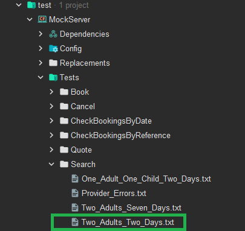
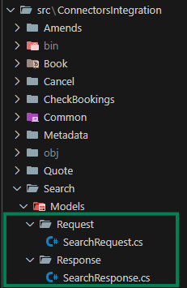
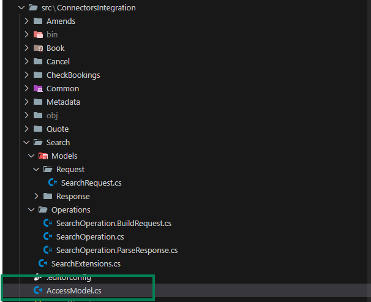
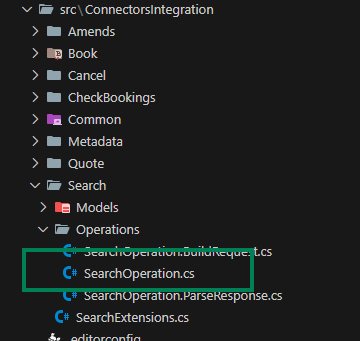
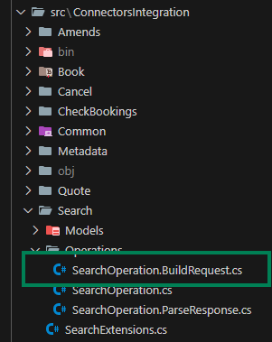

## **Mock**

### **Step 1: Define your Search responses (Mocks)**

Define the responses for your search operation, it is recommended to insert a supplier response into every mock or at least, into the mocks of the operation you will be developing.

We will be using the **TwoAdultTwoDays** mock (in the "**tests -> MockServer -> Tests**" folder) through all the steps of the development.



### **Step 2: Define the Models of your response (Request and Response models)**

These models are crucial because they specify the structure of the objects contained within supplier responses. They'll also play a vital role in serializing and deserializing requests and responses during development.



**Example of a SearchRequest model** (File: SearchRequest.cs):

```csharp
namespace ConnectorsIntegration.Search.Models.Request;

public class SearchRequest
{
    public string CheckIn { get; internal set; }
    public string CheckOut { get; internal set; }
    public string HotelCode { get; internal set; }
    public List<SupplierOccupancy> Occupancy { get; internal set; }
}

public class SupplierOccupancy
{
    public int Adults { get; internal set; }
    public int Children { get; internal set; }
    public IEnumerable<int> Infants { get; internal set; }
}
```

**Example of a SearchResponse model** (File: SearchResponse.cs):

```csharp
namespace ConnectorsIntegration.Search.Models.Response;

public class SearchResponse
{
    public List<SupplierOption> Options { get; set; }
    public string HotelCode { get; set; }
    public string BoardName { get; set; }
    public string HotelName { get; set; }
}

public class SupplierOption
{
    public string Status { get; set; }
    public SupplierPrice SupplierPrice { get; set; }
    public string SupplierPaymentType { get; set; }
    public List<SupplierRoom> Rooms { get; set; }
    public string BoardCode { get; set; }
    public List<SupplierCancelPolicy> SupplierCancelPolicies { get; set; }
}

public class SupplierCancelPolicy
{
    public double PenaltyAmount { get; set; }

    public string PenaltyType { get; set; }

    public string PenaltyCurrency { get; set; }

    public string PenaltyDeadline { get; set; }
}

public class SupplierPrice
{
    public string Currency { get; set; }
    public double Net { get; set; }
    public double MinimumSellingPrice { get; set; }
}

public class SupplierRoom
{
    public uint OccupancyId { get; set; }
    public string RoomCode { get; set; }

    public SupplierPrice SupplierPrice { get; set; }
    public string RoomDescription { get; set; }
}
```

## **Develop**

### **Step 1: Add the necessary serializers**
To specify which serializer the developer will be using (based on the seller's API) we can specify it in our "**Extensions**":

File: SearchExtensions.cs

If the seller works with **JSON** format, we can specify the integration to work with **JSON** with the following:

```csharp
internal static class SearchExtensions
{
    public static void AddSearchServices(this IServiceCollection services,
        IConfiguration configuration)
    {
        //A JsonSerializer service is added along with the request and response model
        services.AddJsonSerializer<SearchRequest, SearchResponse>(ConfigureJSONOptions);
        //The operation is added, indicating what models should be used during the development of the operation
        services.AddSearchOperation<SearchOperation, SearchRequest, SearchResponse, AccessModel>(TgxPlatform.Name,
            configuration);
    }
    private static void ConfigureJSONOptions(JsonSerializerOptions options) { }
}
```

For XML details check [XML Extensions](../Advanced_Usages/Extensions)

For more details about operations, check [PreOperations](../Connector_Framework/PreOperation_Overview) and [Operations](../Connector_Framework/Operation_Overview)

### **Step 2: Define the AccessModel**

The AccessModel is a class that will allow the integration to establish some information before launching the operations.

This class can be found here:



If the integration needs Generic and Search URLs, along with an Apikey, an AccessModel would look like this:

```csharp
public class AccessModel : IBindAccessModel
{
    public string User { get; private set; }
    public string Password { get; private set; }

    public string UrlGeneric { get; private set; }

    public string UrlSearch { get; private set; }

    public string ApiKey { get; private set; }

    public void Bind(string supplier, Access access)
    {
        User = access.User;
        Password = access.Password;
        UrlGeneric = access.Urls.Generic;
        UrlSearch = access.Urls.Search;
        //Parameter that if is not present, will throw and exception
        ApiKey = access.Parameters.GetOrRquired("ApiKey");
    }
}
```

### **Step 3: SearchOperation validators**

There are two previous validations that serve as a filter so the buildrequest and the parseresponse are as safe as possible. They can be found in the SearchOperation.cs class:



**TryValidateModelRequest**

This step validates the incoming request from the client. While most validation is defined in the metadata, this step is used for specific edge cases that cannot be generalized.

**Example Use Case:** In a Search operation, validating that hotel codes are numeric because supplier do not allow non-numeric hotels. This type of validation would not be covered by metadata.

```csharp
public bool TryValidateModelRequest(
    SearchConnectorRequest connectorsRequest, 
    SearchParameters<CntAccessModel> connectorParameters,
    out IEnumerable<AdviseMessage> adviseMessages)
{
    //AdviseMessages are used to specify errors, such as checking if the hotel code is numeric and if not, add an AdviseMessage
    adviseMessages = default;
    return true; // Validation passes if no issues are found.
}

```

**TryValidateSupplierResponses**

Once the supplier's response is received, this step validates it for errors or anomalies. Suppliers may return incomplete or erroneous data, so this step ensures only valid responses are processed further.

**Details**:

- Check for supplier-specific error fields.
- Ensure required fields (e.g., hotel list) are present.
- Example Use Case: A supplier might return a response with an error code or an empty hotel list. This step would detect and handle such cases.

```csharp
public bool TryValidateSupplierResponses(
    SearchParameters<CntAccessModel> connectorParameters,
    IEnumerable<SupplierResponseWrapper<SearchResponse>> supplierResponses,
    out IEnumerable<AdviseMessage> adviseMessages)
{
    var supplierResponseWrappers = supplierResponses as SupplierResponseWrapper<SearchResponse>[] ?? supplierResponses.ToArray();
    
    var success = ResponseValidator.TryValidateSupplierResponses(supplierResponseWrappers, out adviseMessages);

    if (!success) return false;
    
    if (supplierResponseWrappers.ElementAt(0).Response.HotelSearch?.Hotel is null)
    {
        adviseMessages =
        [
            AdviseMessage.BuildSupplierNoResults() // Indicates no results from the supplier.
        ];

        return false;
    }

    return true; // Validation passes if no issues are found.
}
```

### **Step 4: Build the Seller's request**

This class will contain a "BuildRequests" method that will have the following args: 

- Object of the requests previously created (SearchRequest)
- The request that the buyer sends (connectorsRequest)
- Parameters (connectorParameters) which will have some helpers:



**Example of Build Request:**

```csharp
using Connectors.Core.Application.Connection;
using Connectors.Pull.Hotel.Application.Metadata;
using Connectors.Pull.Hotel.Application.Operations.Search;
using Connectors.Pull.Hotel.Domain.Contracts.Common;
using ConnectorsIntegration.Search.Models.Request;

namespace ConnectorsIntegration.Search.Operations;

internal partial class SearchOperation
{
    public IEnumerable<SupplierRequestWrapper<SearchRequest>> BuildRequests(
        SearchConnectorRequest connectorsRequest,
        SearchParameters<AccessModel> connectorParameters)
    {
        SearchCriteria searchCriteria = connectorsRequest.SearchRq.SearchCriteria;
        //Refers to the checkIn of the booking
        string checkIn = searchCriteria.CheckIn;
        //Refers to the checkOut of the booking
        string checkOut = searchCriteria.CheckOut;
        //Refers to the hotelCode of the booking. If the seller allows requests with multiple hotels, the Accomodations should be iterated
        string hotelCode = searchCriteria.Destinations.Accommodations.First().Code;
        //Refers to the occupancy of the booking. If the seller allows requests with multiple occupancies, the Occupancies should be iterated
        Occupancy firstOccupancy = searchCriteria.Occupancies.First();
        OccupancyInfoDetailed occupancyInfoDetailed = _connectorsUtilities.MetadataConnectorsService.GetDetailedOccupancyInfo(firstOccupancy);

        SearchRequest searchRequest = BuildSearchRequest(checkIn, checkOut, hotelCode, occupancyInfoDetailed);

        //Search URL we prepared back in the AccessModel, which will be passed by the buyer
        string searchUrl = connectorParameters.ParametersModel.UrlSearch;

        SupplierRequestWrapper<SearchRequest> supplierRequest = new(
            searchRequest,
            new Uri(searchUrl),
            HttpMethod.Post);

        return
        [
            supplierRequest
        ];
    }

    private static SearchRequest BuildSearchRequest(string checkIn, string checkOut, string hotelCode, OccupancyInfoDetailed occupancyInfoDetailed)
    {
        //The request towards the seller system
      
        return new SearchRequest()
        {
            CheckIn = checkIn,
            CheckOut = checkOut,
            HotelCode = hotelCode,
            Occupancy = new List<SupplierOccupancy>()
            {
                new() {
                    Adults = occupancyInfoDetailed.NumberOfAdults,
                    Children = occupancyInfoDetailed.NumberOfChildren,
                    Infants = occupancyInfoDetailed.InfantAges
                }
            } 
        };
    }
}
```

### **Step 5: Build the Buyer's Response**

Once the request has been sent, we will have to control and parse the response returned by the seller.

We will be implementing the "ParseResponse" step inside SearchOperation:


**Example of Parse Response:**

```csharp
using Connectors.Core.Application.Connection;
using Connectors.Core.Application.Iso;
using Connectors.Core.Domain;
using Connectors.Pull.Hotel.Application.Operations.Search;
using Connectors.Pull.Hotel.Domain.Contracts.Common;
using Connectors.Pull.Hotel.Domain.Contracts.Search.Response;
using ConnectorsIntegration.Search.Models.Response;

namespace ConnectorsIntegration.Search.Operations;

internal partial class SearchOperation
{
    public SearchConnectorResponse ParseResponses(
        SearchConnectorRequest connectorsRequest,
        SearchParameters<AccessModel> connectorParameters,
        IEnumerable<SupplierResponseWrapper<SearchResponse>> supplierResponses,
        CancellationToken cancellationToken)
    {
        //We can safely do First() in case the seller only has one response because we check errors previously
        var supplierResponse = supplierResponses.First().Response;
        return new SearchConnectorResponse(ParseSupplierResponse(connectorsRequest, supplierResponse));
    }

    private SearchRs ParseSupplierResponse(SearchConnectorRequest connectorsRequest, SearchResponse supplierResponse)
    {
        foreach (SupplierOption supplierOption in supplierResponse.Options)
        {
            Status status = MapSellerToTgxStatus(supplierOption.Status);
            Price price = ParseSupplierPrice(supplierOption.SupplierPrice);
            PaymentType paymentType = MapSellerToTgxPaymentType(supplierOption.SupplierPaymentType);
            List<Room> roomList = ParseSupplierRooms(supplierOption.Rooms);
            var checkIn = connectorsRequest.SearchRq.SearchCriteria.CheckInAsDateTime;

            var option = new Option(
                status,
                price,
                [paymentType],
                roomList
                );

            option.CancelPolicy = ParseSupplierCancelPolicies(checkIn, supplierOption.SupplierCancelPolicies);

            //Helper to combine options
            _connectorsUtilities.OptionsGenerator.TryAddHotelOption(
                supplierResponse.HotelCode,
                supplierOption.BoardCode,
                option,
                supplierResponse.HotelName,
                supplierResponse.BoardName);
        }

        // Combine method will return a list of combined accomodation based on the options added
        return new SearchRs(_connectorsUtilities.OptionsGenerator.Combine());
    }

    private OptionCancelPolicy ParseSupplierCancelPolicies(DateTime checkIn, List<SupplierCancelPolicy> supplierCancelPolicies)
    {
        List<CancelPenalty> cancelPenalties = [];

        foreach (SupplierCancelPolicy supplierCancelPolicy in supplierCancelPolicies)
        {
            //Helper to map a string currency
            Currency supplierCurrency = CurrencyIso4217Mapper.Map(supplierCancelPolicy.PenaltyCurrency);
            PenaltyType penaltyType = MapSellerToTgxPenaltyType(supplierCancelPolicy.PenaltyType);
            //Helper to create a policy based in a seller cancel penalty with deadline that has timezone
            var penalty = _connectorsUtilities.CancelPenaltyManager.CancelPenaltyFromDateWithTimeZone(
                checkIn,
                penaltyType,
                supplierCurrency,
                supplierCancelPolicy.PenaltyAmount,
                supplierCancelPolicy.PenaltyDeadline,
                "yyyy-MM-ddTHH:mm:ss.fffffffzzz"
            );
            cancelPenalties.Add(penalty);
        }
        var refundable = cancelPenalties.Any();
        return new OptionCancelPolicy(refundable, cancelPenalties);
    }

    private static List<Room> ParseSupplierRooms(List<SupplierRoom> rooms)
    {
        List<Room> roomList = [];

        foreach (SupplierRoom supplierRoom in rooms)
        {
            var price = ParseSupplierPrice(supplierRoom.SupplierPrice);

            RoomPrice roomPrice = new(price);

            roomList.Add(new Room(
                supplierRoom.OccupancyId,
                supplierRoom.RoomCode,
                supplierRoom.RoomDescription,
                roomPrice
            ));
        }
        return roomList;
    }

    private static PenaltyType MapSellerToTgxPenaltyType(string penaltyType) => penaltyType switch
    {
        "Percent" => PenaltyType.Percentage,
        "Nights" => PenaltyType.Nights,
        _ => PenaltyType.Amount
    };

    private static PaymentType MapSellerToTgxPaymentType(string supplierPaymentType) => supplierPaymentType switch
    {
        "MerchantPay" => PaymentType.MerchantPay,
        "CardBookingPay" => PaymentType.CardBookingPay,
        _ => PaymentType.MerchantPay
    };

    private static Status MapSellerToTgxStatus(string status) => status switch
    {
        "Available" => Status.OK,
        "OnRequest" => Status.RQ,
        _ => Status.Unknown
    };

    private static Price ParseSupplierPrice(SupplierPrice supplierPrice)
    {
        Currency supplierCurrency = CurrencyIso4217Mapper.Map(supplierPrice.Currency);
        //Helper that builds a net price
        var price = Price.BuildNetPrice(supplierCurrency, supplierPrice.Net, supplierPrice.MinimumSellingPrice);

        return price;
    }
}
```

For more details about helpers, check the - [Price helpers](../Tools_and_Helpers/Price_Helpers/PriceHelpers) and [Policies helpers](../Tools_and_Helpers/Policies_Helpers/PoliciesHelpers) 

For more details about the combinatory, check [Recommended Helpers](../Tools_and_Helpers/Recommended_Helpers)

## **Test**

### **Option 1: Connector Integration Tests**
Use the integration tests provided by Travelgate to validate your implementation:
- Add the necessary use cases to the **MockServer** for each operation.
  - [View MockServer Documentation](../Connector_Framework/MockServer_Documentation.mdx).
- Execute the associated tests for the implemented operation.
  - [View Running Integration Tests](../Connector_Framework/Running_Integration_Tests.mdx).

### **Option 2: FormTest Tool (Shopping)**
Use the **FormTest** application to test each operation manually:
- Configure the tool to use your supplier's API settings.
- Test specific scenarios not covered by predefined use cases.
- [View FormTest Documentation](../Tools_and_Helpers/FormTest_Documentation.mdx).
 
## **Code Review**

### **Create Pull Request**

    - Commit your Search changes and push them to a new branch called "**SearchDevelopment**" into the original repository.
    - Separate the Pull Request into minimum these 4 commits:
        - Mock responses
        - Request and Response models
        - BuildRequest
        - ParseResponse

### **Wait for Travelgate review**
    - This step involves waiting for the Travelgate team to review and approve the submitted pull request.