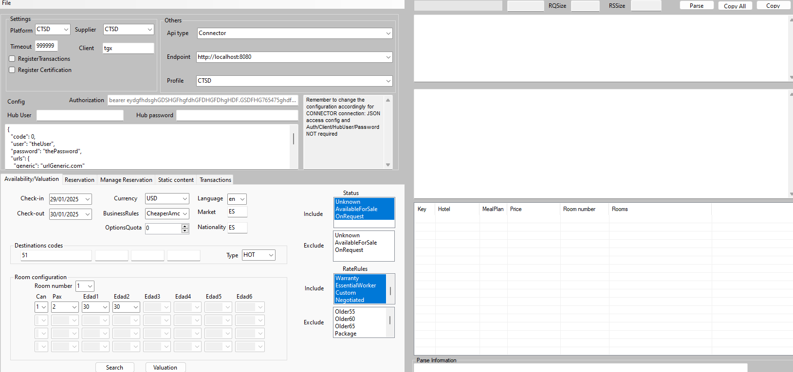
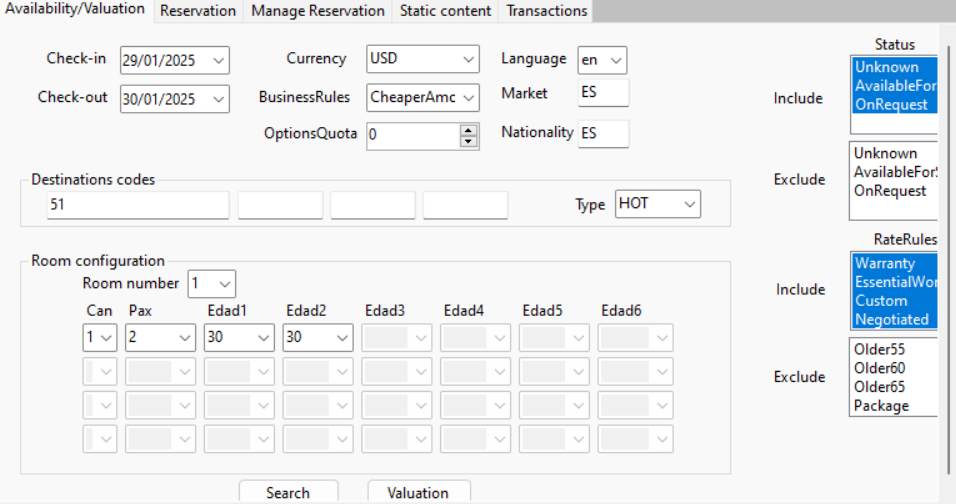
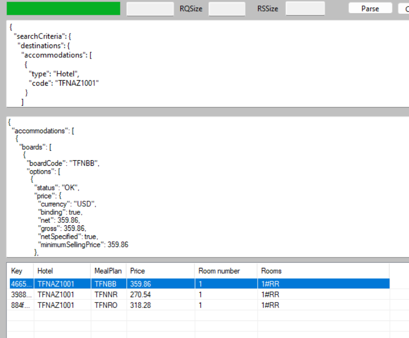
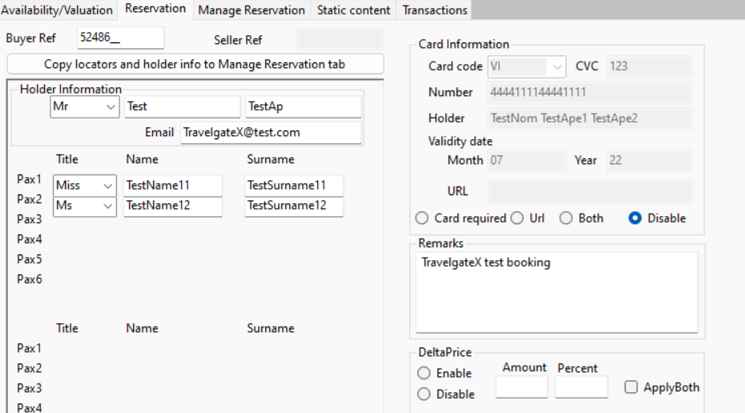
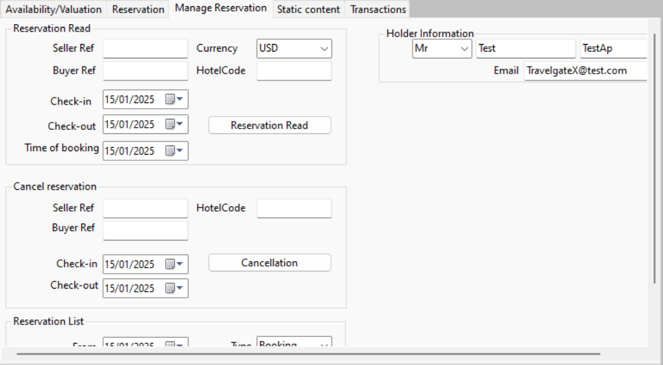

# FormTest

The FormTest is a program designed to assist developers during the Connector development process by allowing manual requests to be made to the Connector. 

## **Downloading and Setting Up FormTest**
The FormTest application can be downloaded from the following repository:
[FormTest GitHub Repository](https://github.com/travelgate-connectors/connectors-pull-hotel-shopping-formtestv3).

### **Configuration**
Once downloaded, create a file named `appsettings.connectors.local.json` in the project `TravelgateX.Pull.Hotel.Formtest.Connectors`. 
An example configuration can be found in `appsettings.connectors.local.json.sample`.

Here is an example of the configuration file:
```json
{
  "PROV_CODE": {
    "SUP_CODE": {
      "User": "theUser",
      "Password": "thePassword",
      "Urls": {
        "Generic": "urlGeneric.com"
      },
      "Parameters": {
        "test1": "value1",
        "test2": "value2"
      }
    }
  }
}
```

### **Profiles**
To add predefined configurations, modify the `profiles.json` file located in the `TravelgateX.Pull.Hotel.Formtest` project.

Here is an example of a profile:
```json
{
  "defaultOnStart": "CTSD",
  "profiles": {
    "CTSD": {
      "platform": "CTSD",
      "supplier": "CTSD",
      "endpointIndex": 0,
      "search": {
        "currency": "USD",
        "hotels": ["51"],
        "from": "2025-01-29",
        "market": "ES",
        "to": "2025-01-30"
      }
    }
  }
}
```

This configuration will automatically start with the specified profile when running the application.

### **FormTest User Interface**

#### **Initial Run**
Before executing any operation, ensure the Connector is running. By default, it runs on port `8080`.

Upon launching the FormTest, the interface will look like this:


#### **Search Tab**
In the **Availability** tab, you can specify search criteria such as:
- Check-in and check-out dates.
- Currency.
- Market.
- Hotel codes.
- Occupancy details.

Once the criteria are selected, click the **Search** button to execute a search request.



#### **Option Selection and Valuation**
If options are available for the specified search criteria, you can select one to evaluate it using the **Valuation** button.



#### **Reservation Tab**
If the valuation (quote) is successful, navigate to the **Reservation** tab to make a booking. You can specify guest details and payment information (if required).



#### **Manage Tab**
The **Manage** tab allows you to perform operations such as:
- Canceling a booking.
- Executing `CheckBookings` operations (both by reference and by date).



### **Unavailable Features**
The **Content** and **Transactions** tabs are not available at this time.

