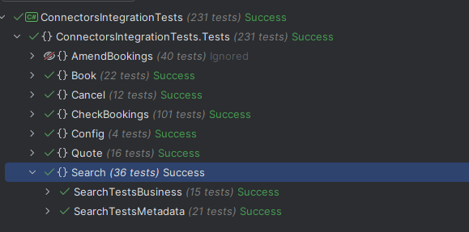
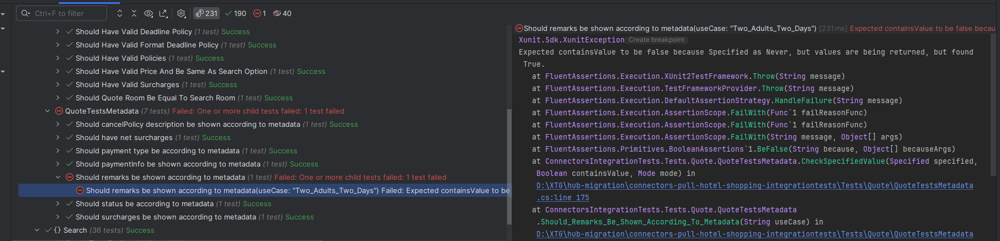

# Running Integration Tests

Once the **MockServer** is configured ([see MockServer Documentation](mock-server-documentation.mdx)), you can execute the integration tests. These tests validate the Connector's functionality and ensure that the Metadata ([see Metadata Documentation](../advanced-configuration/metadata-definition.mdx)) aligns with the integration.

---

## **Getting Started**

1. **Download Integration Tests:**
   Clone or download the test repository from GitHub:
   [Connectors Pull Hotel Shopping Integration Tests](https://github.com/travelgate-connectors/connectors-pull-hotel-shopping-integrationtests)

2. **Configure `appsettings.json`:**
   Update the `appsettings.json` file to include your Connector's Supplier and Platform codes:
   ```json
   {
     "Supplier": "SUPPLIERCODE_DEFINED_BY_TG",
     "ConnectorsPlatform": "PLATFORMCODE_DEFINED_BY_TG"
   }
   ```
   > **Note**: Do not modify other settings in the `appsettings.json` file.

---

## **Running the Tests**

1. **Start the Connector:**
   - Open the Connector project in Visual Studio.
   - Run the Connector in either Debug or Release mode. The service will start on port **8080**.

2. **Start the MockServer:**
   - Open the MockServer project in Visual Studio.
   - Run the MockServer in either Debug or Release mode. The service will start on port **5600**.

3. **Run Integration Tests:**
   - Open the test solution in Visual Studio.
   - Ensure the test explorer is visible (`Test` > `Test Explorer`).
   - Execute the tests from the Visual Studio Test Explorer.

---

## **How It Works**

The integration tests simulate client requests to the Connector. The Connector sends these requests to the MockServer, which acts as the supplier. This architecture validates both the Connector's logic and the supplier's response handling.

---

## **Expected Results**

1. **Success Scenario:**
   When all tests pass, you will see a summary in the Test Explorer indicating success.

   

2. **Failure Scenario:**
   If a test fails, the Test Explorer will display errors. You can view details in the Output or Test Explorer window to identify and resolve issues.

   
