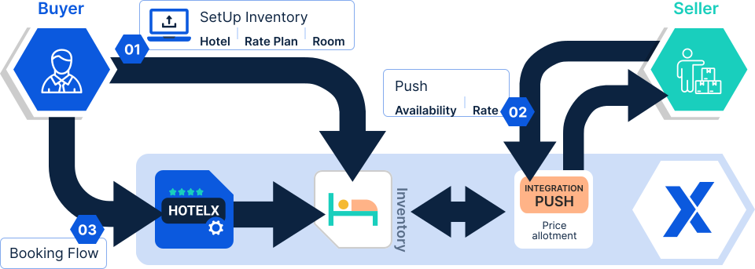

# Quickstart

## Introduction

By combining Inventory Tool and the Hotel Push Sellers API, Channel Managers and Hotel Product Distributors can **push** their products into a TravelgateX database, making them accessible to TravelgateX Buyers.

Inventory Tool receives the data from the different channels and stores it in a common structure. Then, this product can be consumed in 3 different ways by TravelgateX Buyers: via Pull with our [Hotel-X solution](../../for-buyers/hotel-x-pull-buyers-api/quickstart), via Push with our [Channel-X solution](../../for-buyers/channel-x-push-buyers-api/quickstart) or via a Flat File solution.





## Let's get started: How to make your first sale!

If you're a Channel Manager or Supplier seeking a push integration follow the next steps:

### Prerequisites

#### API Endpoint

Hotel Push Seller API, being a XML-based API, utilizes a single endpoint for all operations:

```html
https://pushprovider.xmltravelgate.com/Service/Hotel/Provider/ProviderGEN.svc
```

#### Request Headers

To interact with the API, you'll need to include the following essential request header:

Authentication: Authentication header employs two levels of authentication, namely "Security" and "POS"

1. Security Level: User and password of our Inventory Tool System are transmitted.

2. POS Level: It comprises two fields: RequestorID, which represents the seller code assigned to initiate the request, and CompanyName, which signifies the buyer code assigned to receive the updates.

```html
<SOAP-ENV:Envelope xmlns:SOAP-ENV = "http://schemas.xmlsoap.org/soap/envelope/" xmlns:ns1 = "http://www.opentravel.org/OTA/2003/05" xmlns:ns2 = "http://schemas.xmltravelgate.com/hubpush/provider/2012/10" xmlns:ns3 = "http://docs.oasis-open.org/wss/2004/01/oasis-200401-wss-wssecurity-secext-1.0.xsd">
 <SOAP-ENV:Header>
     <ns3:Security SOAP-ENV:mustUnderstand = "1">
         <ns3:UsernameToken>
             <ns3:Username>XXXXX</ns3:Username>
             <ns3:Password>XXXXXXX</ns3:Password>
         </ns3:UsernameToken>
     </ns3:Security>
 </SOAP-ENV:Header>
 <SOAP-ENV:Body>
     <ns:HotelRatePlanNotif><!--Your request, ex: HotelAvailNotif, HotelRatePlanInventoryRetrieve ...-->
         <ns:request>
             <ns1:POS>
                 <ns1:Source>
                     <ns1:RequestorID ID="Seller Code"/>
                     <ns1:BookingChannel>
                         <ns1:CompanyName Code="Buyer Code"/>
                     </ns1:BookingChannel>
                 </ns1:Source>
             </ns1:POS>
             ...
             ...
         </ns:request>
   </ns:HotelRatePlanNotif>
 </SOAP-ENV:Body>
</SOAP-ENV:Envelope>
``` 
:::caution

You will find the RequestorID (Seller Code) and CompanyName (Buyer Code) values in the email we will send you once the connection is established.

:::

#### Supported Operations

In the context of the Hotel Push Sellers API, you can both push and retrieve information about **Availability**, **Rates**, and **Inventory** (ARI).

* When you **push data**, you'll need to submit a request to Travelgate's system with all the necessary information. If everything goes smoothly, you'll receive a successful response; otherwise, you'll receive an error message.

* On the other hand, when you **retrieve data**, you need to send a request to Travelgate's system to get the information you're looking for. If everything goes well, we'll send you the data that was previously stored in our system as a response; otherwise, we'll notify you of an error.

But now, this quickstart guide will focus on the basics of using the Hotel Push Sellers API to push the ARI to our system and begin making the first sales, so let's dive in and get started!

### 1. Retrieve the setup of the product (Hotel, Rate Plan, Room).

The Inventory message is where the adventure starts! Our aim here is to set up the inventory, which includes the hotel, rate plans, and rooms. This step is typically performed by the Buyer. The Buyer usually accesses our [Inventory Extranet](https://inventory.xmltravelgate.com/Account/Login?ReturnUrl=%2f) to complete the setup there. Consequently, the Seller typically only needs to retrieve the data to map it into their system and subsequently push the availability and rates. If you wish to handle the Inventory push yourself, that is also an option.

[añadir ejemplo de retrieve]

### 2. Push the availability

After a careful review of all the inventory setup retrieved in the previous step, it's time to proceed and push the availability.

[añadir ejemplo de push]

### 3. Push the rates

You're almost there! After pushing the availability, it's time to finish the process by pushing the rates. Once this is done, all the information will be in our database, and the Buyer can start making their first reservations.

[añadir ejemplo de push]

## Next steps

Congratulations on completing this quickstart tutorial! 🎉 You've successfully learned the basics of making your first sale. But there's a world of knowledge waiting for you:

- Explore the [Making Requests](../hotel-push-sellers-api/making-requests/endpoint) section to dive deep into how a XML API works and maximize its performance.
- Discover various methods/messages grouped by the following actions:
    - [Inventory](./availability-rates-and-inventory/inventory/inventory-push): Push the inventory setup (hotel, rate, room).
    - [Availability](./availability-rates-and-inventory/availability/availability-push) and [Rate](./availability-rates-and-inventory/rates/rates-push): Push rate availability, allotment conditions and rate prices and supplements
    - [Manage reservations](./booking-management/overview): Get the hang of reservation management.

Our documentation is a treasure trove of additional features and functionalities to enhance your business. To uncover these valuable resources, explore our documentation further and make the most of these methods. Enjoy your journey!