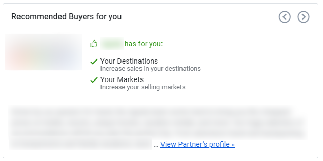
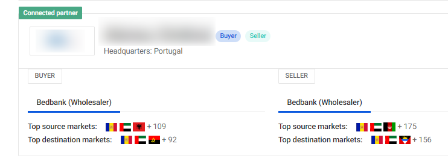
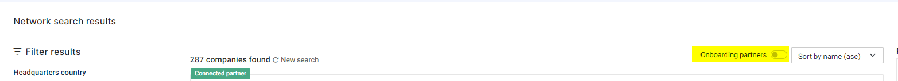

# About our Network

# Unlocking New Opportunities: Connect and Partner with TravelgateX Network!
## Grow your business connections by exploring our Network!
At TravelgateX, we provide tailored recommendations for new connections based on your usage data within our Marketplace. Our advanced algorithms ensure that you not only **expand your Network**, but also increase your booking volume by connecting you with Partners that are most relevant to your trading patterns. 

### How does TravelgateX Partner recommendation work? 🌟
Our suggested connections are carefully selected **based on your performance** and data-driven algorithms. InsightsX thoroughly analyzes your data and cross-references it with global data stored in our Platform. This ensures that Partners who meet your business criteria (listed below) will appear as "Recommended" connections.

* **Your Destinations**: Increase sales in your destinations
* **Your Markets**: Increase your selling markets

And if you want to expand your business:

* **New Destinations**: Expand your business to new destinations!
* **New Markets**: Expand your business to new markets!
### Where do I find recommendations for my Company?  🔍
You can access your recommended connections through both your [Dashboard](https://app.travelgatex.com/dashboardhttps://app.travelgatex.com/dashboard) and our [Network](https://app.travelgatex.com/network). Once you've identified a Partner you'd like to connect with, simply arrange your own contract and request their activation. It's that simple!

### Discover ideal Partners effortlessly with our Network upgrade!🚀
Now you have greater control over search results and access to relevant information in one convenient place. This feature is situated on the left-hand side of the page and includes new filtering options such as:
* Headquarters country
* Company type (Buyer/Seller)
Source markets 
Destination markets
* Category
* Companies already connected to your Company via TravelgateX
* Seller connection type

And that's not all - when it comes to markets, you'll find a menu in the upper right corner with even more thrilling options to explore:

 
### Are you on the hunt for a particular Partner?🔎
Our system now suggests Company names as you type, displaying their logo and type. To visualize or exclude Companies that are currently in the Onboarding status at TravelgateX, you can simply activate or deactivate the "Onboarding partners" option located in the top right corner of the screen.

 

>**<ins>NOTE:**</ins>\
**Wondering why you're seeing recommended Partners you're already connected with?**\
It's because connections without traffic for the last 3 months will be suggested as a reminder for you to reactivate them - after all, they match your business!
